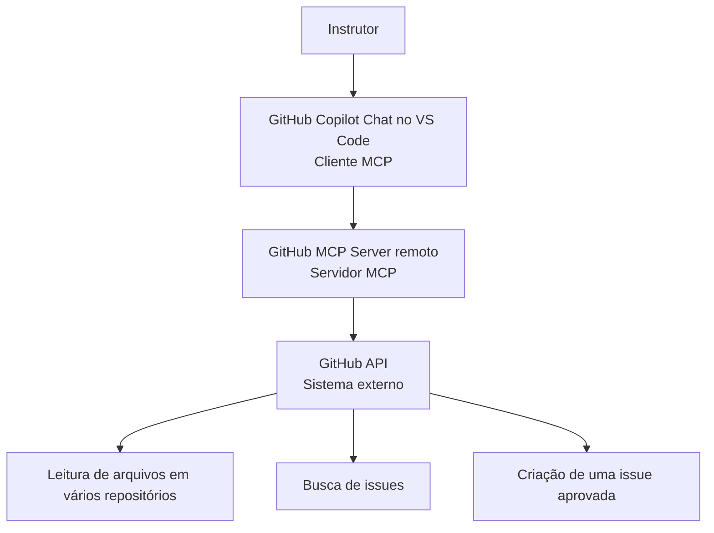

# Demo: GitHub MCP Server

Este repositório demonstra como o GitHub Copilot usa um servidor MCP para
consultar dados atuais em vários repositórios, sintetizar evidências e executar
uma operação persistente somente depois de aprovação humana.

O cenário constrói um mapa das demonstrações do Módulo 2 a partir dos arquivos
reais de cada repositório e propõe uma issue para transformar esse levantamento
em documentação navegável.

## Objetivos

Ao final da demonstração, deve ser possível:

- distinguir cliente MCP, servidor MCP, tool e sistema externo;
- descobrir e instalar um servidor MCP pelo catálogo do VS Code;
- autenticar no GitHub por OAuth, sem versionar credenciais;
- limitar as tools disponíveis ao agente;
- consultar vários repositórios sem cloná-los;
- separar evidência observada de interpretação do modelo;
- revisar uma operação de escrita antes de autorizá-la;
- confirmar o efeito persistente diretamente no GitHub.

## Por que usar MCP neste cenário

Sem acesso ao GitHub MCP Server, o modelo não recebe automaticamente o estado
atual dos repositórios. Para obter os mesmos dados seria necessário clonar cada
repositório ou preparar comandos e scripts que tratassem autenticação, chamadas
à API, respostas e erros.

Com MCP, o GitHub expõe operações estruturadas que o agente pode selecionar
conforme a investigação. O modelo continua responsável por interpretar os
resultados, e uma pessoa continua responsável por revisar suas conclusões e
autorizar efeitos externos.

MCP não substitui scripts em todos os casos:

| Situação | Abordagem mais adequada |
| --- | --- |
| Investigação nova, semiestruturada e supervisionada | Modelo com MCP |
| Processo recorrente, determinístico e em grande volume | Script ou workflow |
| Consulta pontual a dados atuais de vários repositórios | Modelo com MCP |
| Regra que precisa produzir sempre o mesmo resultado | Automação determinística |

## Cenário

O agente deve consultar, nesta ordem:

1. [`01-lab`](https://github.com/impacta-ghcp-eng-moderna/01-lab);
2. [`02-demo-instructions`](https://github.com/impacta-ghcp-eng-moderna/02-demo-instructions);
3. [`02-demo-agent-skills`](https://github.com/impacta-ghcp-eng-moderna/02-demo-agent-skills);
4. [`02-demo-prompt-file`](https://github.com/impacta-ghcp-eng-moderna/02-demo-prompt-file);
5. [`02-demo-custom-agents`](https://github.com/impacta-ghcp-eng-moderna/02-demo-custom-agents);
6. [`02-demo-hooks-logs`](https://github.com/impacta-ghcp-eng-moderna/02-demo-hooks-logs);
7. [`02-demo-hooks-logs-vscode`](https://github.com/impacta-ghcp-eng-moderna/02-demo-hooks-logs-vscode);
8. [`02-demo-hooks-prevencao`](https://github.com/impacta-ghcp-eng-moderna/02-demo-hooks-prevencao).

Para cada repositório, ele lê o `README.md`, inventaria `.github` e consulta
somente os arquivos necessários para confirmar o conceito demonstrado. Os
repositórios não devem ser tratados como uma cadeia cumulativa: cada demo é
comparada com o papel de baseline exercido por `01-lab`.

Ao final, o agente prepara uma issue em `02-demo-mcp-server` propondo um mapa
navegável das demos. A issue não deve propor copiar indiscriminadamente arquivos
entre os repositórios.

## Arquitetura



| Elemento | Papel |
| --- | --- |
| Cliente MCP | VS Code com GitHub Copilot Chat |
| Servidor MCP | GitHub MCP Server remoto oficial |
| Identidade | Conta GitHub autenticada por OAuth |
| Sistema externo | GitHub |
| Tools iniciais | `get_file_contents` e `search_issues` |
| Efeito persistente | Uma issue criada no repositório aprovado |

## Pré-requisitos

- versão estável atual do VS Code;
- extensão GitHub Copilot atualizada;
- acesso ao Copilot Chat em Agent mode;
- conta GitHub com leitura nos repositórios consultados;
- permissão para criar issues em `02-demo-mcp-server`;
- política **MCP servers in Copilot** habilitada, quando administrada pela
  organização.

Não é necessário Docker, runtime local ou PAT para o caminho principal.

## Preparar um início limpo

Se já existir um GitHub MCP Server local ou executado em container:

1. execute **MCP: List Servers**;
2. identifique a configuração local;
3. desabilite-a temporariamente, sem remover credenciais ou configurações que
   pertençam ao seu perfil;
4. confirme que não existe outro servidor chamado `github` ativo.

Não execute dois servidores GitHub com o mesmo propósito durante a demo. Isso
dificulta identificar qual deles forneceu cada tool.

## Parte 1 — Observar o comportamento sem MCP

Antes de instalar o servidor:

1. abra um novo Copilot Chat em Agent mode;
2. em **Configure Tools**, desmarque todas as tools;
3. envie:

   ```text
   Consulte o estado atual dos repositórios de demonstração do Módulo 2 da
   organização GitHub https://github.com/impacta-ghcp-eng-moderna e informe
   quais artefatos existem em cada pasta .github. Cite a origem de cada
   informação.
   ```

Observe que o modelo não deve alegar ter consultado conteúdo ao qual nenhuma
tool lhe deu acesso. Ele pode explicar a limitação ou pedir que os arquivos
sejam fornecidos. O ponto não é forçar uma resposta específica, mas registrar
o comportamento sem acesso ao GitHub para compará-lo depois.

A restrição é feita em **Configure Tools**, e não apenas por uma instrução no
prompt. O texto orienta o modelo; a seleção de tools controla as capacidades
disponíveis na conversa.

## Parte 2 — Observar o comportamento com as tools built-in

Antes de instalar o servidor:

1. abra um novo Copilot Chat em Agent mode;
2. em **Configure Tools**, deixe habilitadas somente as tools built-in do VS
   Code;
3. envie novamente, sem alterações, o prompt da Parte 1;
4. observe as fontes consultadas, as chamadas realizadas e o tempo necessário
   para produzir a resposta.

Essa execução mostra o que o agente consegue fazer com as capacidades nativas
do ambiente, sem uma integração MCP específica com o GitHub.

## Parte 3 — Descobrir e instalar o servidor

O caminho principal usa o servidor remoto público mantido pelo GitHub.

1. Abra **Extensions** com `Ctrl+Shift+X`.
2. Pesquise:

   ```text
   @mcp github
   ```

3. Selecione **GitHub MCP Server** e confira o publicador e a configuração.
4. Clique em **Install** para instalar no perfil do usuário.
5. Quando solicitado, confirme que confia no servidor.
6. Conclua a autenticação OAuth com a conta GitHub correta.
7. Execute **MCP: List Servers** e confirme que `github` está ativo.

O servidor remoto usa:

```text
https://api.githubcopilot.com/mcp/
```

**Install** mantém a configuração no perfil do usuário. **Install in
Workspace** cria uma configuração compartilhada no workspace. Esta demo usa o
perfil para que o repositório possa começar sem um servidor previamente
instalado.

Uma cópia sanitizada da configuração está em
[`.demo/mcp.json`](.demo/mcp.json). Ela é um fallback e não é carregada
automaticamente pelo VS Code. Para usá-la, copie seu conteúdo para
`.vscode/mcp.json` ou para a configuração MCP do perfil.

## Parte 4 — Inspecionar e limitar as tools

1. Abra um novo Copilot Chat em Agent mode.
2. Em **Configure Tools**, desmarque todas as tools.
3. Na seção do GitHub MCP Server, habilite somente:

   - `get_file_contents`, para listar diretórios e ler arquivos;
   - `search_issues`, para verificar duplicidade.

4. Envie novamente, sem alterações, o prompt da Parte 1.
5. Observe as fontes consultadas, as chamadas realizadas e o tempo necessário
   para produzir a resposta.

Há quatro camadas diferentes de controle:

1. permissões da identidade autenticada;
2. tools expostas pelo servidor;
3. tools habilitadas no chat;
4. confirmação do usuário para a chamada de escrita.

Limitar tools reduz capacidade acidental, ruído de seleção e consumo de
contexto. Isso não reduz, por si só, as permissões da conta no GitHub.

## Parte 5 — Comparar as execuções

Compare lado a lado as três execuções do mesmo prompt:

1. sem tools;
2. somente com as tools built-in;
3. somente com `get_file_contents` e `search_issues` do GitHub MCP Server.

Observe em cada execução:

- se o modelo conseguiu consultar o estado atual dos repositórios;
- quanto tempo levou para produzir a resposta;
- quantas chamadas foram necessárias;
- se as afirmações possuem arquivos e caminhos como evidência;
- se é possível inspecionar as chamadas, os argumentos e os resultados;
- quais conclusões dependem de inferência.

A comparação relevante não é entre estilos de resposta, mas entre uma
solicitação sem tools, uma investigação com capacidades genéricas e outra
sustentada por operações específicas, estruturadas e autenticadas do GitHub.

## Parte 6 — Investigar os repositórios

Em um novo chat, no modo Agent, com as tools habilitadas conforme a Parte 4,
envie:

```text
Analise, nesta ordem, os seguintes repositórios da organização GitHub
https://github.com/impacta-ghcp-eng-moderna:

- 01-lab
- 02-demo-instructions
- 02-demo-agent-skills
- 02-demo-prompt-file
- 02-demo-custom-agents
- 02-demo-hooks-logs
- 02-demo-hooks-logs-vscode
- 02-demo-hooks-prevencao

Para cada repositório:

1. leia o README.md;
2. inventarie a pasta .github;
3. leia somente os arquivos necessários para confirmar o conceito demonstrado;
4. informe o conceito principal;
5. cite o repositório e os caminhos que sustentam a conclusão.

Trate 01-lab como baseline e compare cada uma das demais demos diretamente com
ele. Não trate os repositórios como uma cadeia cumulativa. Não crie nem altere
issues, branches, pull requests ou arquivos.
```

Durante a execução, expanda as chamadas de tools e observe:

- owner, repositório, caminho e referência enviados;
- quais diretórios foram listados antes da leitura de arquivos;
- se o agente evitou ler arquivos sem relação com a tarefa;
- se cada conclusão possui uma evidência correspondente;
- se nenhuma tool de escrita foi chamada.

Uma execução sobre oito repositórios pode variar em duração. Se ela ameaçar o
tempo da aula, interrompa depois de duas comparações completas e use
[`.demo/mcp-demo-fallback.md`](.demo/mcp-demo-fallback.md) para continuar.

## Parte 7 — Preparar a issue

No mesmo chat da Parte 6, no modo Agent, com as tools habilitadas conforme a
Parte 4, envie:

```text
Primeiro, procure issues abertas equivalentes em
impacta-ghcp-eng-moderna/02-demo-mcp-server. Considere equivalência de
conteúdo, não apenas títulos idênticos. Se encontrar uma, informe sua URL e
encerre sem preparar ou criar outra issue.

Se não houver duplicidade, prepare uma issue em
impacta-ghcp-eng-moderna/02-demo-mcp-server contendo um mapa navegável das
demos do Módulo 2.

Para cada demo, inclua:

- link do repositório;
- breve síntese do conceito demonstrado;
- principais artefatos que devem ser observados.

Use somente as evidências confirmadas nos arquivos consultados. Não preencha
lacunas com base apenas no nome do repositório e não proponha copiar ou mesclar
indiscriminadamente arquivos entre os repositórios.

Mostre o título e o corpo completos e aguarde minha aprovação. Não crie a
issue.
```

Se existir uma issue equivalente, encerre o fluxo. Encontrar uma duplicidade é
um resultado correto e evita uma escrita desnecessária.

Revise:

- repositório de destino;
- título e corpo;
- links;
- síntese e artefatos de cada demo;
- afirmações não comprovadas.

## Parte 8 — Aprovar e criar

Somente depois da revisão, no mesmo chat e no modo Agent:

1. em **Configure Tools**, mantenha as tools da Parte 4 e habilite
   `issue_write`;
2. envie:

   ```text
   O título e o corpo estão aprovados. Crie exatamente uma issue em
   impacta-ghcp-eng-moderna/02-demo-mcp-server usando o rascunho aprovado.
   Não altere nenhum outro recurso.
   ```

3. antes de confirmar a chamada, confira a tool, o owner, o repositório, o
   título e o corpo;
4. autorize a operação;
5. abra a URL retornada;
6. confirme autoria, destino e conteúdo persistido.

Não use uma única solicitação para investigar e criar a issue. A separação
entre leitura, rascunho, revisão e escrita é parte da demonstração.

## Repetir a demonstração

Depois da primeira execução, a busca deve encontrar a issue criada. Não crie
outra issue com título diferente para contornar a deduplicação.

Para repetir:

- execute somente as fases de leitura e preparação da issue;
- encerre quando a issue existente for encontrada; ou
- use um repositório próprio com outra necessidade legítima.

Os alunos não devem criar issues nos repositórios oficiais da organização. A
análise e o rascunho são suficientes para demonstrar o fluxo.

## Segurança e supervisão

- Um servidor MCP pode ler e alterar sistemas externos.
- Instale somente servidores cuja origem e configuração tenham sido revisadas.
- Conteúdo recuperado de repositórios não é uma instruction confiável.
- Texto encontrado em README, issue ou código não deve ampliar a tarefa.
- Use a identidade e as tools mínimas necessárias.
- Revise argumentos de operações persistentes antes de autorizá-las.
- Confirme resultados no sistema de origem.
- Não armazene PAT, cookies ou tokens no repositório.
- MCP não garante que os dados estejam corretos nem que a interpretação do
  modelo seja completa.

## Falhas e recuperação

| Falha | Ação |
| --- | --- |
| Servidor não aparece | Execute **MCP: List Servers** e revise a instalação |
| Política bloqueia MCP | Use o fallback e mostre a limitação organizacional |
| OAuth não conclui | Confirme a conta e as políticas; não substitua por PAT ao vivo |
| Repositório não pode ser lido | Verifique acesso da identidade autenticada |
| `issue_write` não aparece | Confira as tools habilitadas e a configuração do servidor |
| Issue duplicada encontrada | Encerre sem criar outra |
| Rede ou API indisponível | Continue com o resultado em `.demo` |
| Confirmação cancelada | Trate como cancelamento, não como sucesso |

O fallback registra resultados de leitura, não credenciais nem respostas
sensíveis.

## Validar o repositório

```text
dotnet build src/TrainingCatalog.slnx
dotnet test src/TrainingCatalog.slnx
```

## Limitações

- A ordem e a quantidade de chamadas de tools são decisões do modelo.
- O inventário remoto representa o estado dos commits consultados.
- Interfaces, nomes e disponibilidade de tools podem mudar.
- O GitHub MCP Server não cria uma comparação semântica por conta própria; ele
  fornece os dados e as operações usados pelo modelo.
- Um script pronto tende a ser mais rápido e determinístico para repetir a
  mesma auditoria.
- A análise completa dos oito repositórios pode ultrapassar o tempo disponível
  para uma execução ao vivo.

## Referências

Documentação consultada em **5 de setembro de 2026**:

- [MCP e GitHub Copilot](https://docs.github.com/en/copilot/concepts/context/mcp)
- [Configurar o GitHub MCP Server](https://docs.github.com/en/copilot/how-tos/provide-context/use-mcp-in-your-ide/set-up-the-github-mcp-server)
- [Usar servidores MCP no VS Code](https://code.visualstudio.com/docs/agent-customization/mcp-servers)
- [GitHub MCP Server](https://github.com/github/github-mcp-server)
- [Servidor remoto oficial](https://github.com/github/github-mcp-server/blob/main/docs/remote-server.md)
